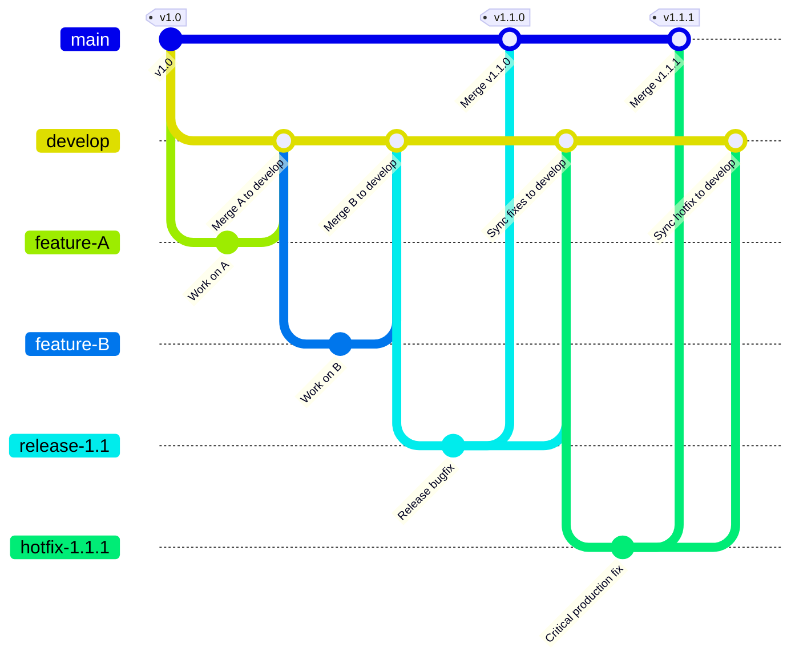

### **The GitFlow Workflow**

#### **1. Introduction: What is GitFlow?**

GitFlow is a structured Git branching model, first published by Vincent Driessen, that codifies a robust framework for managing larger, more complex projects with formal, versioned releases.

While modern, high-velocity DevOps practices often favor simpler, **Trunk-Based Workflows** like GitLab Flow, understanding GitFlow is essential for any senior engineer. It is a legacy workflow that you will encounter in many established enterprise projects, particularly those involving desktop applications, on-premises software, or libraries with multiple supported versions in production.

Unlike Trunk-Based Development, which prioritizes a single source of truth (`main`), GitFlow uses **two** long-lived branches to manage the state of the project: `main` and `develop`. It also introduces several types of temporary, supporting branches with specific purposes: `feature`, `release`, and `hotfix`.

#### **2. How It Works: The Core Branches**

The central concept of GitFlow is the separation of the official release history from the ongoing development history.

  

*   **`main` Branch:**
    *   **Purpose:** This branch represents the official, production-ready release history of the project.
    *   **Content:** The code on `main` is always stable and deployable. Every commit on `main` is a new production release and should be tagged with a version number (e.g., `v1.0.1`, `v2.0.0`).
    *   **Rule:** Direct commits to `main` are forbidden. Code only arrives on `main` by being merged from a `release` or `hotfix` branch.

*   **`develop` Branch:**
    *   **Purpose:** This is the primary development and integration branch. It reflects the latest state of development for the *next* planned release.
    *   **Content:** While `develop` is generally stable, it is a "work-in-progress" branch and is not guaranteed to be production-ready at all times.
    *   **Rule:** All `feature` branches are created from `develop` and are merged back into `develop`.

#### **3. The Supporting Branches**

GitFlow uses three types of temporary branches to manage the flow of code between `develop` and `main`.

##### **3.1. `feature` Branches**
These are identical in concept to the feature branches in Trunk-Based Development, with one critical difference in their origin.

  

*   **Purpose:** To develop a new feature for an upcoming release.
*   **Workflow:**
    1.  Branched from: **`develop`**.
    2.  Merged back into: **`develop`**.
*   **Rule:** `feature` branches should never interact directly with the `main` branch.

##### **3.2. `release` Branches**
These branches are unique to GitFlow and are used to prepare and stabilize a new production release.

  

*   **Purpose:** To isolate a nearly-complete release for final testing, bug fixing, and documentation. This allows the `develop` branch to remain open for new features for the *next* release.
*   **Workflow:**
    1.  Branched from: **`develop`** (when it is deemed "feature-complete" for the release).
    2.  Merged back into: **`main`** (to finalize the release) and also back into **`develop`** (to ensure any bug fixes made on the release branch are incorporated into future development).

##### **3.3. `hotfix` Branches**
These branches are used to address critical bugs in a production release.

  

*   **Purpose:** To create a quick patch for an issue on the live `main` branch without disrupting the ongoing work on `develop`.
*   **Workflow:**
    1.  Branched from: **`main`**. This is the only supporting branch that originates from `main`.
    2.  Merged back into: **`main`** (to patch production) and also into **`develop`** (to ensure the bug is fixed for the next release).

#### **4. The Complete GitFlow Workflow (Diagram)**

The interaction of all these branches creates a comprehensive but complex flow of changes through the repository.

#### **5. Summary: Key Takeaways**

*   **Strict Structure:** GitFlow is a highly structured workflow with specific roles for each branch. This can be beneficial for larger teams or projects where strict process control is required.
*   **Release-Based:** The model is optimized for a software lifecycle with planned, versioned releases. It allows for parallel development of new features while an existing release is being stabilized.
*   **Complexity:** The primary drawback of GitFlow is its complexity. Managing two long-lived branches and the correct merge paths for `release` and `hotfix` branches can be error-prone and requires a high level of discipline from the team.
*   **CI/CD Challenges:** The long-lived nature of `feature` branches and the `develop` branch can delay integration, which runs counter to the core principles of modern Continuous Integration. This can lead to large, difficult merges and makes it harder to achieve a rapid, continuous delivery cadence.

While not always the first choice for modern web applications, understanding GitFlow is a critical skill for any DevOps professional, as it provides a powerful set of patterns for managing software releases in a controlled, versioned manner.