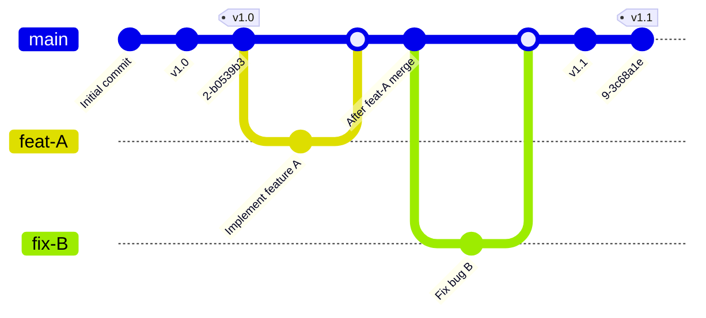
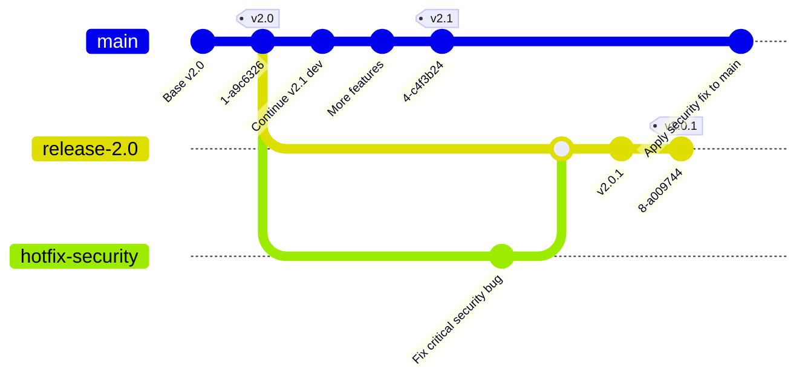

## **Trunk-Based Development & GitLab Flow**

### **1. Introduction: Why a Modern Branching Strategy Matters**

In our labs, you have practiced a specific workflow: creating a short-lived branch, making a small change, and merging it back quickly via a Merge Request. This is not arbitrary; it is a deliberate engineering practice designed for speed and quality. This practice is known as **Trunk-Based Development (TBD)**.

It stands in contrast to older, more complex models like the "Managed Release Strategy" (a simplified GitFlow) mentioned in the book, which uses long-lived `development` branches for quarterly or monthly releases. While that model has its uses, it is fundamentally slower and introduces a higher risk of large, complex merges.

In modern DevOps, the goal is to **reduce the batch size of changes** and **increase the frequency of integration**. TBD is the foundational branching strategy that enables this.

### **2. Core Principles of Trunk-Based Development (TBD)**

TBD is a simple ruleset that enforces continuous integration.

1. **A Single Source of Truth (The Trunk):** There is one primary, central branch that represents the current, stable state of the project. In modern Git, this branch is named **`main`**.

2. **Short-Lived Feature Branches:** All new work—every feature, bug fix, or experiment—is done on a branch created directly from `main`. These branches should exist for a short period, ideally less than a day, and represent a small, logical change.

3. **Continuous Integration via Merge Requests:** As soon as a change is ready, it is proposed for integration back into `main` via a Merge Request (MR). This MR is the focal point for automated testing (CI) and peer code review.

4. **Release from the Trunk:** The `main` branch is always considered "green" and ready for deployment. Releases are not a separate, long process; a release is simply a snapshot of `main` at a specific point in time.

**Basic TBD Workflow Diagram:**



### **3. GitLab Flow: The Enterprise Implementation of TBD**

While TBD provides the core principles, **GitLab Flow** adds practical, enterprise-ready enhancements. For clarity, we will examine its two primary workflows separately: the continuous delivery workflow and the release maintenance workflow.

#### **3.1. Workflow 1: Feature Development with Environment Branches**

This is the most common and powerful application of GitLab Flow, used for continuous delivery to environments like `staging` and `production`.

- **Workflow:** Code flows downstream. A feature is merged into `main`. To deploy, `main` is merged into `staging`. After validation, `staging` is merged into `production`.
- **GitLab Integration:** These environment branches are configured in GitLab as **Protected Branches**, with deployment jobs in `.gitlab-ci.yml` set to run only on them.

**Diagram: Feature Development & Environment Promotion**

```mermaid
gitGraph
   commit id: "Initial v2.0"
   commit tag: "v2.0"
   branch staging
   branch production
   checkout main
   commit id: "Start development"
   branch feat-A
   commit id: "Develop feature A"
   checkout main
   merge feat-A
   commit id: "Feature A integrated"
   commit tag: "v2.1"
   checkout staging
   merge main
   commit id: "Deployed to staging"
   checkout production
   merge staging
   commit id: "Promoted to production"
```

#### **3.2. Workflow 2: Release Branch Maintenance (for versioned software)**

This workflow is used for projects that need to support and patch older, specific versions that are already in production.

- **Workflow:** A critical bug is found in an older version (e.g., `v2.0`). A `hotfix` branch is created from the corresponding `release` branch. The fix is merged back into the release branch and tagged as a patch release (e.g., `v2.0.1`).
- **Upstream Sync:** Crucially, the fix must also be applied to `main` to prevent the bug from reappearing in future releases. This is often done via `cherry-pick`.

**Diagram: Release Branch Maintenance with a Hotfix**



### **4. Benefits of GitLab Flow**

- **Simplicity and Readability:** The Git history remains linear and easy to understand.
- **Enables CI/CD:** The frequent integration into `main` is the engine of CI/CD, providing rapid feedback.
- **Reduces Merge Conflicts:** Short-lived branches and small changes dramatically reduce the pain of merge conflicts.
- **Clear Deployment Pathway:** The environment branches create a visible, auditable path from development to production.

### **5. Prerequisites for Success (The Non-Negotiables)**

Adopting GitLab Flow requires a commitment to engineering discipline and automation.

1. **Comprehensive Automated Testing:** Since `main` must always be stable, your CI pipeline must have a robust suite of tests that run on every single merge request.

2. **Fast and Reliable Builds:** The feedback loop must be fast (ideally under 15 minutes).

3. **Strong Code Review Culture:** Merge Requests are the primary gate for quality.

4. **Feature Flags:** For larger changes, use feature flags to merge incomplete work into `main` safely.

### **6. Comparison: GitLab Flow vs. The "Managed Release" (GitFlow) Model**

| Aspect                    | GitLab Flow (Trunk-Based)                                | GitFlow (Managed Release)                                                    |
| :------------------------ | :------------------------------------------------------- | :--------------------------------------------------------------------------- |
| **Primary Branch**        | `main`                                                   | `develop`                                                                    |
| **Feature Branches**      | Branch from `main`, merge to `main`.                     | Branch from `develop`, merge to `develop`.                                   |
| **Branch Lifetime**       | Very short (hours to days).                              | Can be long-lived within a release cycle.                                    |
| **Integration Frequency** | High (multiple times per day).                           | Lower (tied to the release cycle).                                           |
| **Complexity**            | Low. Fewer long-lived branches.                          | High. Manages `develop`, `release`, `hotfix`, and `main`.                    |
| **Best Suited For**       | Teams practicing CI/CD, web applications, SaaS products. | Projects with scheduled, versioned releases and multiple supported versions. |

### **7. Key Takeaways**

- **Trunk-Based Development** is the foundation of modern CI/CD practices.
- **GitLab Flow** provides practical patterns for implementing TBD in real-world scenarios.
- **Environment branches** enable safe, controlled promotion of code through staging to production.
- **Release branches** allow you to maintain and patch older versions while continuing forward development.
- Success requires **automation, testing, and discipline**—but the payoff is faster delivery and higher quality.