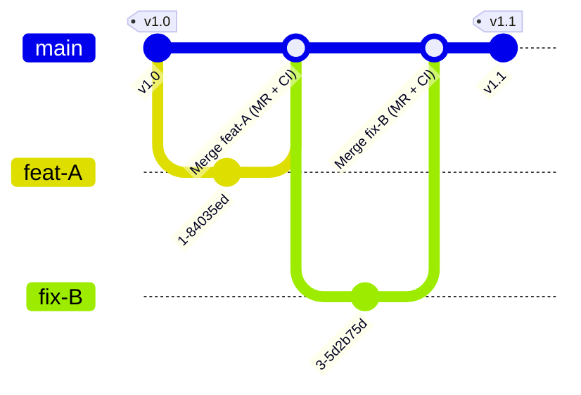

### **Trunk-Based Development & GitLab Flow**


#### **1. Introduction: Why a Modern Branching Strategy Matters**

In our labs, you have practiced a specific workflow: creating a short-lived branch, making a small change, and merging it back quickly via a Merge Request. This is not arbitrary; it is a deliberate engineering practice designed for speed and quality. This practice is known as **Trunk-Based Development (TBD)**.

It stands in contrast to older, more complex models like the "Managed Release Strategy" (a simplified GitFlow) mentioned in the book, which uses long-lived `development` branches for quarterly or monthly releases. While that model has its uses, it is fundamentally slower and introduces a higher risk of large, complex merges.

In modern DevOps, the goal is to **reduce the batch size of changes** and **increase the frequency of integration**. TBD is the foundational branching strategy that enables this.

#### **2. Core Principles of Trunk-Based Development (TBD)**

TBD is a simple ruleset that enforces continuous integration.

1.  **A Single Source of Truth (The Trunk):** There is one primary, central branch that represents the current, stable state of the project. In modern Git, this branch is named **`main`**.
2.  **Short-Lived Feature Branches:** All new work—every feature, bug fix, or experiment—is done on a branch created directly from `main`. These branches should exist for a short period, ideally less than a day, and represent a small, logical change.
3.  **Continuous Integration via Merge Requests:** As soon as a change is ready, it is proposed for integration back into `main` via a Merge Request (MR). This MR is the focal point for automated testing (CI) and peer code review.
4.  **Release from the Trunk:** The `main` branch is always considered "green" and ready for deployment. Releases are not a separate, long process; a release is simply a snapshot of `main` at a specific point in time.

**Basic TBD Workflow Diagram:**


#### **3. GitLab Flow: The Enterprise Implementation of TBD**

While TBD provides the core principles, **GitLab Flow** adds practical, enterprise-ready enhancements that address the complexities of deploying to multiple environments and managing releases. It extends TBD with specific, long-lived branches for different purposes.

This is the workflow we, as enterprise architects, recommend and implement.

##### **3.1. The Core: Feature Branches and `main`**
This is identical to TBD and is what you have practiced. The `main` branch is the primary development trunk and the target for all feature branch merge requests. Code merged to `main` is considered tested and ready for the next step.

##### **3.2. Environment Branches (for Continuous Delivery)**
This is the most powerful addition. GitLab Flow introduces long-lived branches that directly map to your deployment environments (e.g., `staging`, `production`).

*   **Workflow:** Code flows downstream. A change is merged into `main`. To deploy it to the next environment, a merge request is created from `main` to `staging`. After validation on staging, another MR is created from `staging` to `production`.
*   **GitLab Integration:** These branches are configured in GitLab as **Protected Branches**. The deployment jobs in your `.gitlab-ci.yml` are configured with `rules` to run only on these specific branches, often with a `when: manual` step for controlled, one-click deployments.

##### **3.3. Release Branches (for Maintenance)**
For projects that need to support older versions (e.g., a library or an on-premises product), GitLab Flow supports creating release branches from `main` at a specific version (e.g., `release-2.5`).

*   **Workflow:** Bug fixes (hotfixes) are created on a branch from the relevant `release-*` branch. They are then merged back into that release branch.
*   **Upstream Merge:** Critically, these hotfixes must also be merged "upstream" into `main` to ensure the fix is included in all future development.

**GitLab Flow Diagram (with Environment and Release Branches):**
```mermaid
gitGraph
    commit id: "v2.4"
    branch release-2.5
    checkout main
    branch staging
    branch production
    branch feat-A
    commit id: "work on feat-A"
    checkout main
    merge feat-A id: "Merge feat-A (MR)"
    commit id: "More work on main"
    checkout staging
    merge main id: "Deploy to Staging"
    checkout production
    merge staging id: "Promote to Prod"
    checkout release-2.5
    branch hotfix-C
    commit id: "Fix critical bug"
    checkout release-2.5
    merge hotfix-C id: "v2.5.1" tag: "v2.5.1"
    checkout main
    merge release-2.5 id: "Merge hotfix upstream"
```

#### **4. Benefits of GitLab Flow**

*   **Simplicity and Readability:** The Git history remains linear and easy to understand.
*   **Enables CI/CD:** The frequent integration into `main` is the engine of CI/CD, providing rapid feedback.
*   **Reduces Merge Conflicts:** Short-lived branches and small changes dramatically reduce the pain of merge conflicts.
*   **Clear Deployment Pathway:** The environment branches create a visible, auditable path from development to production.

#### **5. Prerequisites for Success (The Non-Negotiables)**

Adopting GitLab Flow is not just a process change; it requires a commitment to engineering discipline and automation.

1.  **Comprehensive Automated Testing:** Since `main` must always be stable, your CI pipeline must have a robust suite of unit, integration, and (ideally) end-to-end tests that run on every single merge request.
2.  **Fast and Reliable Builds:** If the CI pipeline takes hours to run, developers will be discouraged from integrating frequently. The feedback loop must be fast (ideally under 15 minutes).
3.  **Strong Code Review Culture:** Merge Requests are the primary gate for quality. The team must be committed to performing timely and thorough code reviews.
4.  **Feature Flags:** For larger changes that cannot be completed in a single day, developers use feature flags. This allows them to merge incomplete work into `main` safely, with the new feature "turned off" in production until it is complete.

---

#### **6. Comparison: GitLab Flow vs. The "Managed Release" (GitFlow) Model**

| Aspect                    | GitLab Flow (Trunk-Based)                                                                          | GitFlow (Managed Release)                                                                                        |
| :------------------------ | :------------------------------------------------------------------------------------------------- | :--------------------------------------------------------------------------------------------------------------- |
| **Primary Branch**        | `main`                                                                                             | `develop`                                                                                                        |
| **Feature Branches**      | Branch from `main`, merge to `main`.                                                               | Branch from `develop`, merge to `develop`.                                                                       |
| **Branch Lifetime**       | Very short (hours to days).                                                                        | Can be long-lived within a release cycle.                                                                        |
| **Integration Frequency** | High (multiple times per day).                                                                     | Lower (tied to the release cycle).                                                                               |
| **Release Process**       | `main` is always releasable. A release is a merge from `main` to an environment or release branch. | A formal "release branch" is created from `develop`, then merged to `main` and tagged.                           |
| **Complexity**            | Low. Fewer long-lived branches.                                                                    | High. Manages `develop`, `release`, `hotfix`, and `main` branches simultaneously.                                |
| **Best Suited For**       | Teams practicing CI/CD, web applications, SaaS products.                                           | Projects with scheduled, versioned releases (e.g., desktop software, libraries) and multiple supported versions. |

---

